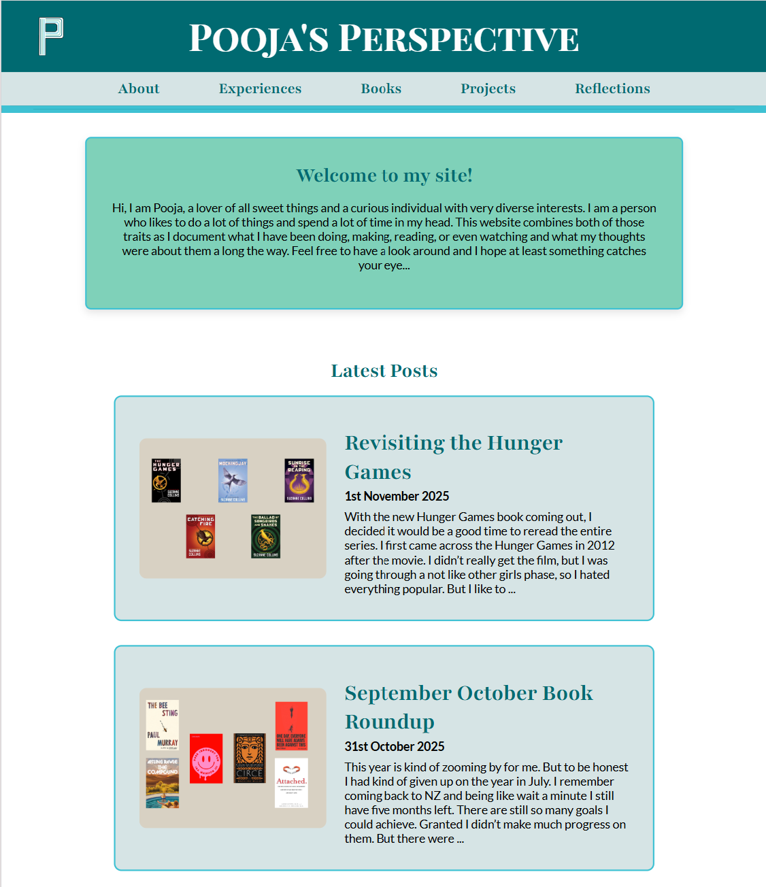

# README

## Introduction

I created this website using Jekyll and it is hosted on GitHub Pages. It uses a custom theme and is part blog and part website portfolio. The website documents my various hobbies and interests. You can visit the website at [ppat965.github.io](https://ppat965.github.io)



## Table of Contents

- [Introduction](#introduction)
- [Table of Contents](#table-of-contents)
- [Features](#features)
- [Directory Structure](#directory-structure)
- [Development Set-up](#development-set-up)
- [Design Decisions](#design-decisions)
- [Future Improvements](#future-improvements)
- [Credits](#credits)
- [License](#license)

## Features

- Custom homepage with navigation based on categories
- Lazy-loading images across posts
- Reading section with monthly book collage images
- Mobile-friendly layout with optimized spacing
- Footer with social links (Discord, GitHub, LinkedIn, Email)

## Directory Structure

The website structure is the following:

```plaintext
.
├── _posts/               # Blog posts
├── _categories/          # Index pages of Categories
├── _layouts/             # Default + Page + post layouts
├── _includes/            # shared components (header, footer, head)
├── _sass/                # SCSS partials
├── assets/
│   ├── css/              # compiled style.css
│   ├── images/           # site images + post thumbnails
│   └── js/               # any scripts
├── index.html            # Home page
├── about.md              # About page
└── config.yml            # Jekyll configuration

```

## Development Set-up

To run the website locally you will need to have Ruby installed. The website was built using Ruby version 3.3.8 and the jekyll gem 4.4.1. Then use the following:

```bash
# Clone the repo
git clone https://github.com/ppat965/ppat965.git.io

cd ppat965.git.io

# Install dependencies
bundle install

# Run locally
bundle exec jekyll serve
```

The website will be available at ```http://localhost:4000```

## Design Decisions

Most of my design decisions were made based on what looked good to me, some were deliberate that I am jotting down for future reference.
- Chose to make blog posts image first for visual story-telling
- Using postcards with 4:3 image thumbnails for visual appeal
- Chose a blue-green palette for the whole site and considering accessibility in process
- Website was designed with mobile layout first and then desktop layout
- Image sizes are max 800px width and using lazy loading for performance

## Future Improvements

I am using GitHub issues to keep track of any future improvements I will make to the site. This is so I do not get stuck in perpetual developer mode. The exhaustive list of issues can be found there.

The few items that I will implement in future are:
- Implement searchbar functionality
- Change the site logo
- Add social preview images for linksharing

## Credits

- Jekyll
- GitHub Pages
- Font Awesome icons
- SCSS for styling
- Minima theme for inspiration
- Just the Docs theme for inspiration
- Beautiful Jekyll theme for inspiration 

## License

This project is free to clone or reference for personal use.

Please do not reuse my writing, images, or blog content.